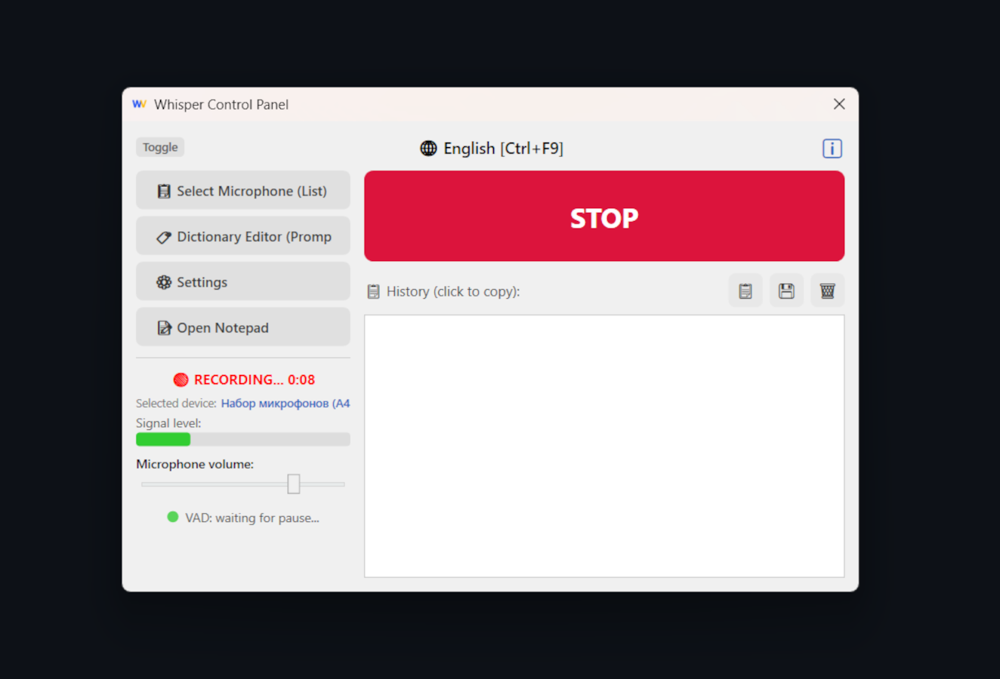
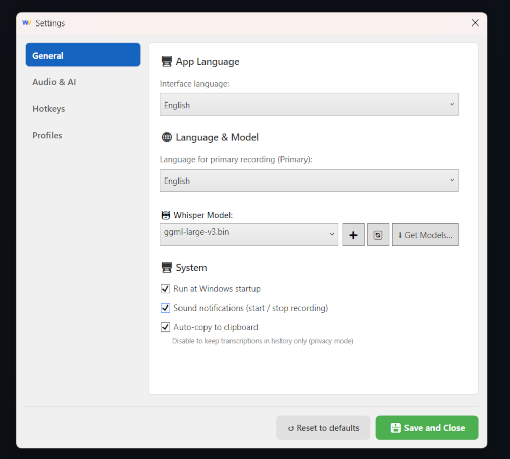
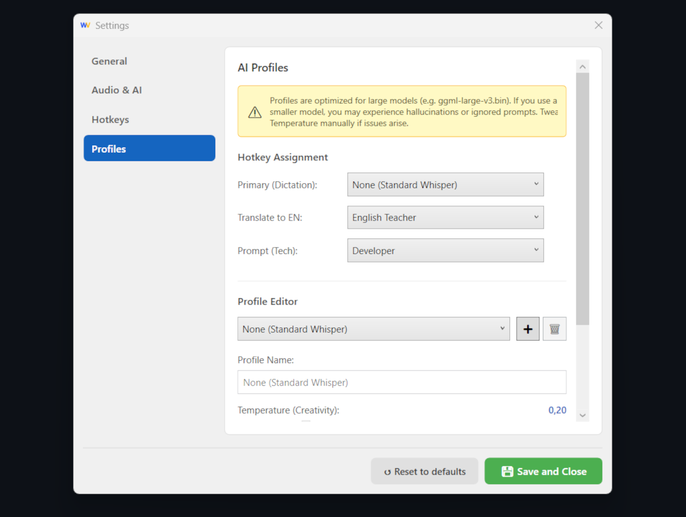

<p align="center">
  
</p>

<h1 align="center">WhisperVoice</h1>

<p align="center">
  <b>Next-generation voice input for Windows — 100% local, 0% cloud.</b><br/>
  A native WPF application on .NET 8, powered by <a href="https://github.com/ggerganov/whisper.cpp">whisper.cpp</a> for on-device speech recognition.
</p>

<p align="center">
  
  
  
  
</p>

---

## 📸 Screenshots

<p align="center">
  
  
</p>
<p align="center">
  
  
</p>

---

## 🛡️ Why WhisperVoice Over Cloud-Based Alternatives?

| | **WhisperVoice** | **Cloud Services** (Google, Azure, Deepgram, AssemblyAI) |
|---|---|---|
| **Privacy** | ✅ Audio **never** leaves your PC. Files are automatically deleted after transcription. | ❌ Your voice is sent to third-party servers and may be stored indefinitely. |
| **Cost** | ✅ **Free forever.** No subscriptions, usage limits, or API keys. | ❌ Plans start at $0.006/min — heavy usage adds up to tens of dollars monthly. |
| **Offline Mode** | ✅ Fully autonomous operation. Airplane, bunker, submarine — works everywhere. | ❌ No internet — no transcription. |
| **Latency** | ✅ On-device GPU inference via Vulkan. Results in **1–3 seconds** for short phrases. | ❌ Network round-trip adds 300–2000 ms even on fast connections. |
| **Sensitive Data** | ✅ Perfect for medicine, law, NDA documents — nothing ever leaks. | ❌ Data passes through third-party servers. GDPR/HIPAA compliance is trust-based. |
| **Hardware Acceleration** | ✅ Vulkan GPU for any graphics card (NVIDIA, AMD, Intel). Automatic CPU fallback. | ⚠️ Acceleration only on the provider's side. |
| **Customization** | ✅ 6 models to choose from (75 MB – 2.9 GB), fine-tuned VAD, Beam Size, Temperature, custom prompts. | ❌ Black box — settings are limited by the API. |

---

## ✨ Key Features

### 🎙️ Speech Recognition
- **Transcription** in 7 languages: English, Russian, Ukrainian, Polish, German, Spanish, French
- **Translation** from any language to English with a single keystroke
- **Profile system & Prompt mode** — built-in "Business" and "Medical" profiles, plus custom dictionary injection for terminology hints
- **System audio capture (Loopback)** — transcribe audio from any app (Zoom, YouTube, Discord)

### ⌨️ Two Input Modes
- **Toggle** — press the key → recording starts, press again → stop
- **Push-to-Talk** — hold the key → recording, release → stop and transcribe

### 🧠 Intelligent Processing
- **VAD (Voice Activity Detection)** — automatic stop when a speech pause is detected
- **Hallucination filter** — filters out false Whisper outputs (e.g. "thanks for watching", "subtitles by", etc.)
- **Post-processor** — cleans artifacts, timestamps, and whisper.cpp tags from output
- **Auto-paste** — result is automatically copied to clipboard and pasted (Ctrl+V) into the active window

### 🔧 Infrastructure
- **Model Manager** — download models from HuggingFace with SHA-256 integrity verification
- **Profiles & Dictionary** — switch between general, business, or medical profiles, or use a custom dictionary of technical terms
- **Notepad** — built-in notepad for accumulating transcriptions
- **History** — log of all transcriptions with export support (click to copy)
- **Windows Autostart** — optional launch at system startup
- **7 interface languages** — the app is fully translated, switching requires no restart

---

## ⌨️ Hotkeys

> All keys are configurable in **Settings → Hotkeys** (F4–F12).  
> Default values are shown below.

### Hotkey Matrix

| Action | Key | Description |
|---|---|---|
| **Record** (primary language) | `F8` | Transcribe speech in the selected language |
| **Record** (Loopback capture) | `Ctrl+F8` | Same, but captures system audio instead of the microphone |
| **Translate** to English | `F9` | Records speech and automatically translates to English |
| **Translate** (Loopback) | `Ctrl+F9` | Translation from system audio |
| **Record with prompt** | `F10` | Records with technical dictionary injection |
| **Prompt** (Loopback) | `Ctrl+F10` | Prompt-enhanced recording from system audio |
| **Control Panel** | `F7` | Show / hide the main window |
| **Notepad** | `Ctrl+F7` | Show / hide the built-in notepad |

### `Ctrl` Modifier Logic

- **Without Ctrl** → recording from **microphone** 🎤
- **With Ctrl** → capturing **system audio** 🔊 (Loopback — everything playing through speakers)

### Operating Modes

| Mode | Behavior |
|---|---|
| **Toggle** (default) | First press — start recording, second press — stop and transcribe |
| **Push-to-Talk** | Hold the key — recording in progress. Release — stop and transcribe |

---

## 🖥️ System Requirements

| Component | Minimum | Recommended |
|---|---|---|
| **OS** | Windows 10 x64 | Windows 11 x64 |
| **Runtime** | .NET 8.0 Desktop Runtime | — |
| **RAM** | 4 GB | 8+ GB |
| **GPU** | Any with Vulkan 1.1+ | NVIDIA/AMD with 6+ GB VRAM |
| **Disk** | ~100 MB (Tiny model) | ~3 GB (Large v3 model) |

> If no Vulkan-compatible GPU is available, the application automatically falls back to CPU inference.

---

## 📦 Whisper Models

Models can be downloaded from the built-in manager (**Settings → Get Models**) or manually from [HuggingFace](https://huggingface.co/ggerganov/whisper.cpp).

| Model | Size | GPU VRAM | Speed | Quality |
|---|---|---|---|---|
| **Tiny** | 75 MB | — | ⚡⚡⚡⚡⚡ | ⭐ |
| **Base** | 142 MB | — | ⚡⚡⚡⚡ | ⭐⭐ |
| **Small** | 466 MB | 2 GB | ⚡⚡⚡ | ⭐⭐⭐ |
| **Medium** | 1.5 GB | 4 GB | ⚡⚡ | ⭐⭐⭐⭐ |
| **Large v3 Turbo** ⭐ | 1.6 GB | 6 GB | ⚡⚡⚡ | ⭐⭐⭐⭐⭐ |
| **Large v3** | 2.9 GB | 8 GB | ⚡ | ⭐⭐⭐⭐⭐ |

---

## 🚀 Quick Start

1. **Download** the installer `WhisperVoice_Setup_v1.0.exe` from [Releases](../../releases)
2. **Install** — the installer handles everything (Inno Setup)
3. **Select a microphone** in the control panel
4. **Download a model** → Settings → Get Models → choose one that fits your hardware
5. **Press F8** — speak — the result appears in your clipboard!

### Build from Source

```powershell
git clone https://github.com/kharohiy/WhisperVoice.git
cd WhisperVoice
dotnet build WhisperVoice/WhisperVoice.csproj -c Release
dotnet run --project WhisperVoice/WhisperVoice.csproj
```

---

## 🏗️ Architecture

### Service Layer

| Service | Responsibility |
|---|---|
| **HotkeyOrchestrationService** | Global hotkeys via NHotkey (Toggle) and WH_KEYBOARD_LL hooks (Push-to-Talk) |
| **RecordingOrchestrationService** | State machine for the full record → process → transcribe pipeline |
| **AudioCaptureService** | WASAPI microphone and Loopback audio capture via NAudio |
| **WhisperExecutionService** | Launches `whisper-cli.exe` with configured parameters |
| **HallucinationFilter** | Filters false-positive neural network outputs using pattern matching |
| **TextPostProcessorService** | Cleans timestamps, tags, and artifacts from raw Whisper output |
| **ModelConfigService** | Loads model catalog; enforces a domain whitelist for downloads |
| **ModelDownloadService** | Downloads models from HuggingFace with streaming SHA-256 verification |
| **ClipboardService** | STA-thread marshaling for clipboard access |
| **HistoryService** | In-memory transcription history with export |
| **TrayIconService** | System tray icon and context menu |

### Project Structure

| Directory | Contents |
|---|---|
| `WhisperVoice/Services/` | All business logic services (listed above) |
| `WhisperVoice/Views/` | WPF windows and user controls |
| `WhisperVoice/ViewModels/` | MVVM view models (model manager) |
| `WhisperVoice/Resources/` | Localization files (7 languages) |
| `WhisperVoice/dictionary/` | User dictionary + hallucination filter patterns |
| `WhisperVoice.Tests/` | xUnit test suite (57 tests) |

### Tech Stack

| Technology | Purpose |
|---|---|
| **WPF** (.NET 8, C# 12) | Desktop UI framework |
| **whisper.cpp** + Vulkan | Speech-to-text inference with GPU acceleration |
| **NAudio 2.3** | WASAPI audio capture (microphone + loopback) |
| **NHotkey.Wpf 4.0** | Global hotkey registration |
| **InputSimulatorCore** | Automated Ctrl+V paste injection |

---

## 🔒 Privacy Policy

WhisperVoice is a **Privacy-First** application:

- 🚫 **No network requests** — audio and text are never sent to external servers
- 🗑️ **Automatic cleanup** — the temporary WAV file is deleted on every startup and shutdown
- 🔇 **Log masking** — user prompts are recorded in logs as `[REDACTED_PROMPT]`
- 🛡️ **Domain whitelist** — model downloads are only allowed from `huggingface.co` and `raw.githubusercontent.com`

---

## 🧪 Testing

57 automated tests (xUnit + Moq + FluentAssertions):

```powershell
dotnet test WhisperVoice.Tests/WhisperVoice.Tests.csproj
```

| Test Class | Coverage Area |
|---|---|
| `TextPostProcessorTests` | Whisper artifact cleanup (timestamps, tags, spaces) |
| `SilenceAndHallucinationTests` | Silence detection and repetitive loop filtering |
| `HallucinationFilterTests` | False-positive pattern filtering |
| `ModelConfigServiceTests` | Network isolation, domain whitelist, 404 fallback |
| `RecordingOrchestratorTests` | State machine, race condition guards |
| `ChaosStressTests` | Concurrency stress tests |
| `AppSettingsProfileTests` | Default profile initialization (Business, Medical) |
| `Phase1HardeningTests` | Temporary data cleanup, invalid model handling |
| `LocalizationRuntimeTests` | Runtime interface language switching |

---

## 📄 License

MIT License — free to use, modify, and distribute.

---

<p align="center">
  <b>WhisperVoice</b> — your voice stays yours. 🎤🔒
</p>
